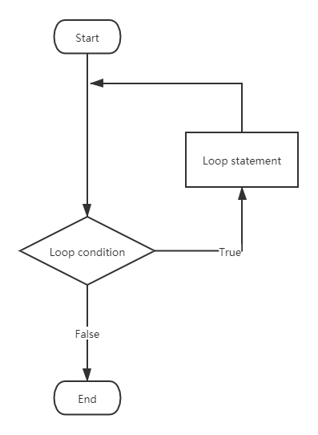
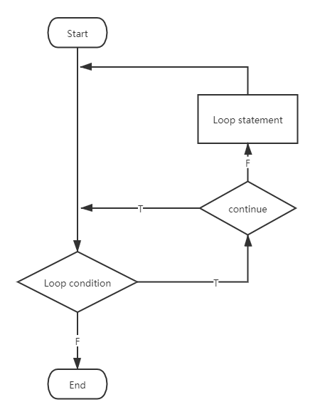
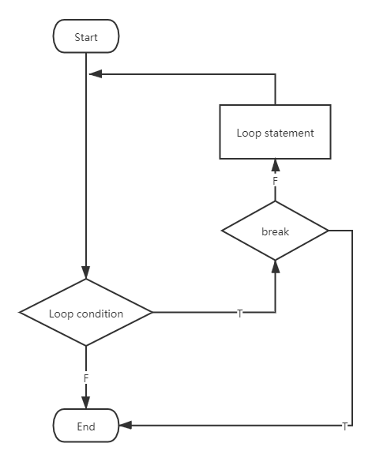

Loop Statement
==============

Normal program runs sequentially, Loop Statement makes the code block run
repeatedly.

In Python, we use ``for`` or ``while`` to build loop statement, and use
``continue``, ``break`` to control it.

``continue`` is used to stop the current loop and start from the next.

``break`` is used to stop the whole loop.

For-Loop
--------

For-loop is like a traversal. Syntax is like:

.. code-block:: python

    for iter_item in iterable_sequence:
        ...

It's actually a traversal of an iterable sequence like list, str, etc. That
brings giant convenience, which means we don't need to get elements from
their indices. If you are familiar with some other programming languages,
you probably do for-loop like:

.. code-block:: python

    animals = ['dog', 'cat', 'elephant', 'tiger', 'lion']
    for index in range(len(animals)):
        print(animals[index])

It's not wrong but there is an easier and more pythonic way:

.. code-block:: python

    for animal in animals:
        print(animal)

They print the same results:

.. code-block:: text

    dog
    cat
    elephant
    tiger
    lion

You are able to get the element from the sequence one by one easily.

There is also a ``for-else`` expression:

.. code-block:: python

    for animal in animals:
        print(animal)
    else:
        print('loop end')

Output:

.. code-block:: text

    dog
    cat
    elephant
    tiger
    lion
    loop end

It means when the loop is finished without any break, the statement in
``else`` will be executed. In the following case, ``'loop end'`` will not
be printed.

.. code-block:: python

    for animal in animals:
        if animal == 'tiger':
            break
        else:
            print(animal)
    else:
        print('loop end')

Output:

.. code-block:: text

    dog
    cat
    elephant

While-Loop
----------

While-loop is like:

.. code-block:: python

    while condition_statement:
        ...

Program never ends when the condition statement is ``True``.

For example:

.. code-block:: python

    while True:
        print(1)

Then ``print(1)`` will be executed continuously forever.

Similar to for-loop, while-loop can also use ``while-else`` syntax.

Exercises
---------

Let's enjoy an easy exercise. Finish in `exercise.py`_, and check the answer
in `answer.py`_.

.. _`exercise.py`: https://github.com/TnTomato/python-tutorial/blob/master/Chapter5-LoopStatement/exercise.py
.. _`answer.py`: https://github.com/TnTomato/python-tutorial/blob/master/Chapter5-LoopStatement/answer.py

